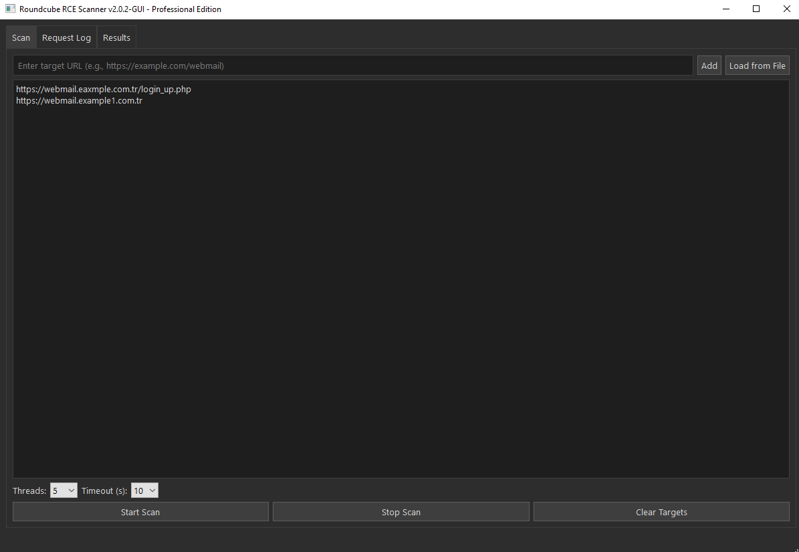
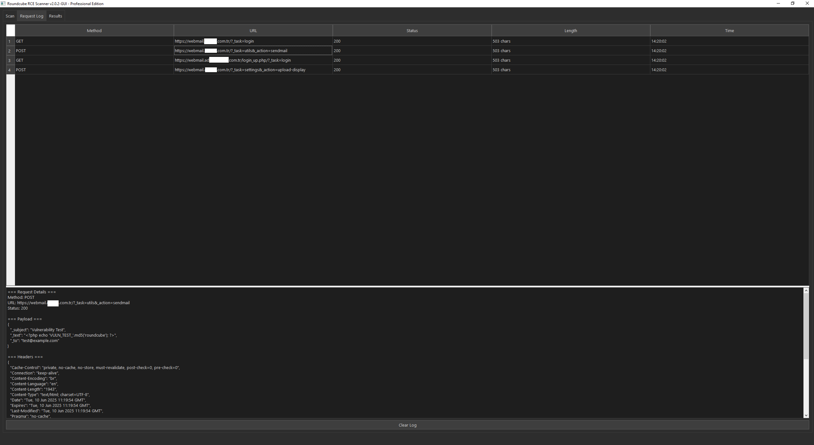
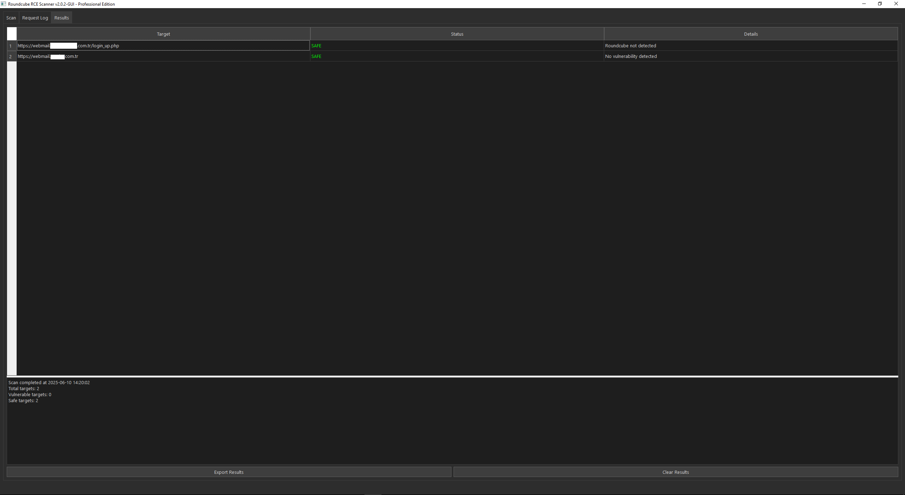

Tabii! Aşağıda, verdiğin içeriği daha profesyonel, temiz ve okunabilir bir `README.md` formatında düzenledim. İstersen bunu GitHub veya kendi dokümanlarında kullanabilirsin:

```markdown
# 🔍 RoundcubeVulnScanner - Roundcube Webmail RCE Vulnerability Scanner 🔍

🚀 **Professional Edition** | 🛠️ **Pentest Tool** | ⚠️ **Ethical Use Only**

---

## 📌 Proje Hakkında

Bu araç, Roundcube Webmail uygulamalarındaki kritik güvenlik açıklarını tarar:

- ✔️ Uzaktan Kod Çalıştırma (RCE)  
- ✔️ CSV/HTML Enjeksiyonu  
- ✔️ Kimlik Doğrulama Atlama  

---

## 1. Kurulum

- Python 3.8 ve üzeri gereklidir.  
- Bağımlılıkları yüklemek için terminalde şu komutu çalıştırın:

```bash
pip install -r requirements.txt
```

---

## 2. Kullanım

### Tek Hedef Tarama

```bash
python scanner.py -u https://webmail.hedefsite.com
```

### Çoklu Hedef Tarama

```bash
python scanner.py -f targets.txt -o report.json
```

### Parametreler

| Parametre | Açıklama                      | Varsayılan   |
|-----------|------------------------------|--------------|
| `-u URL`  | Tek hedef URL                | -            |
| `-f DOSYA`| Hedef URL listesi içeren dosya | -            |
| `-o RAPOR`| Sonuçları JSON formatında kaydetme | -            |
| `-t THREAD`| Thread sayısı                | 5            |
| `-v`      | Detaylı çıktı modu           | Kapalı       |

---

## 3. Ekran Görüntüleri

  
  
  

---

## 4. Yasal Uyarı

**UYARI:** Bu araç yalnızca aşağıdaki durumlarda kullanılmalıdır:

- ✅ Yazılı izin alınmış sistemlerde  
- ✅ Etik hackleme ve eğitim amaçlı  
- ✅ Sorumlu açık bildirim süreçlerinde  

**İzinsiz kullanımlar** TCK 243. madde ve GDPR hükümlerine göre suç teşkil eder ve ciddi yaptırımlara yol açar.

---

## 5. Örnek Çıktı

```
[+] https://webmail.hedefsite.com:443 - VULNERABLE (CVE-2020-35730)
[-] https://webmail2.hedefsite.com:443 - Secure
```

---

## Geliştirici

Ebubekir Baştar  
[GitHub Profili](https://github.com/ebubekirbastama)

---

**GitHub Repo:**  
https://github.com/ebubekirbastama/RoundcubeVulnScanner
```

---

İstersen ayrıca dosyayı Markdown olarak da hazırlayıp gönderebilirim. Başka düzenleme veya ekleme ister misin?
